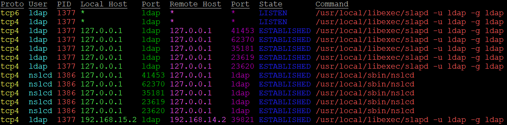

# About

Provides a enhances colorized netstat like tool that is capable of doing searches.



The search criteria can be any of the following.

* CIDR
* Command
* CPU usage percent
* port
* host
* memory usage percent
* PID
* PTR
* state
* UID
* username
* wait channel

# Command Line Options
```
-a         Show all connections.
--drp      Do not resolve port names.
-i         Invert the sort.
-l         Show the listening ports.
-n         Do not resolve the PTRs.
--nc       Do not use colors.
--pct      Show memory and CPU usage percent.
-S <sort>  The Net::Connection::Sort to use.
-t         Show only TCP connections.
-u         Show only UDP connections.
-W         Show the wchan.

-c <CIDRs>  A comma seperated list of CIDRs to search for.
--ci        Invert the CIDR search.

-C    Show the command to the first space.
--Cl  Show the whole command.

--cmd <cmds> A comma seperated list of commands to search for.
--cmdi       Invert the command search.

--cpu <pct> Show connections belonging to procs matching this CPU usage percent.
--cpui      Invert the CPU search.

--mem <pct> Show connections belonging to procs matching this memory usage percent.
--memi      Invert the memory usage search.

-p <ports>  A comma seperated list of ports to search for.
--pi        Invert the port search.

-P <protos> A comma seperated list of protocols to search for.
--Pi        Invert your protocol search.

--pid <pids> A comma separated list of PIDs to search for.
--pidi       Invert the pid search.

--ptrr <rgx>   A comma seperated list of regex to use for a PTR search.
--ptrri        Invert the RegexPTR search.
--lptrr <rgx>  A comma seperated list of regex to use for a local PTR search.
--lptrri       Invert the local RegexPTR search.
--rptrr <rgx>  A comma seperated list of regex to use for a remote PTR search.
--rptrri       Invert the remote RegexPTR search.

--ptr <PTRs>   A comma seperated list of PTRs to search for.
--ptri         Invert the PTR search.
--lptr <PTRs>  A comma seperated list of local PTRs to search for.
--lptri        Invert the local PTR search.
--rptr <PTRs>  A comma seperated list of remote PTRs to search for.
--rptri        Invert the remote PTR search.

-s <states>  A comma seperated list of states to search for.
--si         Invert the state search.

-U <users>   A comma seperated list of usernames to search for.
--Ui         Invert the username search.

--uid <uids> A comma separated list of UIDs to search for.
--uidi       Invert the UID search.

-w <rgx>     A comma separated list of regexp to use for matching wchan values.
--wi         Invert the wchan search.

The default available sort methods are as below.
host_f   foreign host
host_fl  foreign host, local host
host_l   local host
host_lf  local host, foreign host
pid      process ID
port_f   foreign port, numerically
port_fa  foreign port, alphabetically
port_l   local port, numerically
port_la  local port, alphabetically
proto    protocol
ptr_f    foreign PTR
ptr_l    local PTR
state    state
uid      user ID
user     username

For CPU, memory, PID, and UID searches, the equalities below can be
used, by directly prepending them to the number.
<
<=
>
>=
```

# Examples

    ncnetstat -s established,time_wait

Return a list of connection that are in the established or time_wait state.


    ncnetstat -c ::1/128,127.0.0.1/32

Return all connections to localhost.

    ncnetstat -c 192.168.15.2/32 -l

Display all connections listening explicitly on 192.168.15.2.

    ncnetstat -S host_f -i

Sort the connections by the foreign host and invert the results.

    ncnetstat -c 10.0.0.0/24 --ci

Show connections that are either not locally or remotely part of the
10.0.0.0/24 subnet.

    ncnetstat --ptr foo.bar

Find connections to/from IPs that have a PTR record of foo.bar.

    ncnetstat --ptr foo.bar --ptri

Find connections to/from IPs that do not have a PTR record of foo.bar.

    ncnetstat -n --uid '>1000' --Cl

Show every connection by a user with a UID greater than 1000, do not resolve
PTR info and print the whole command.

    ncnetstat -U www -p 80,443 --pi

Show every connecttion by the user www that is not a HTTP or HTTPS connection.

   ncnetstat --cpu '>5' --Cl --pct -W

Search for connections from procs using more than 5% of the CPU time. Show memory
and CPU usage as well whole command and wait channel.

# Installing

## FreeBSD

    pkg install perl5 p5-App-cpanminus lsof
    cpanm Net::Connection::ncnetstat
    
## Linux

### CentOS

    yum install cpanm lsof
    cpanm Net::Connection::ncnetstat

### Debian

This has been tested as working on Debian 9 minimal.

    apt install perl perl-base perl-modules make cpanminus lsof gcc 
    cpanm Net::Connection::ncnetstat
# TODO

* Add support for more collection methods than Net::Connection::lsof

* Support color selection and column ordering.
